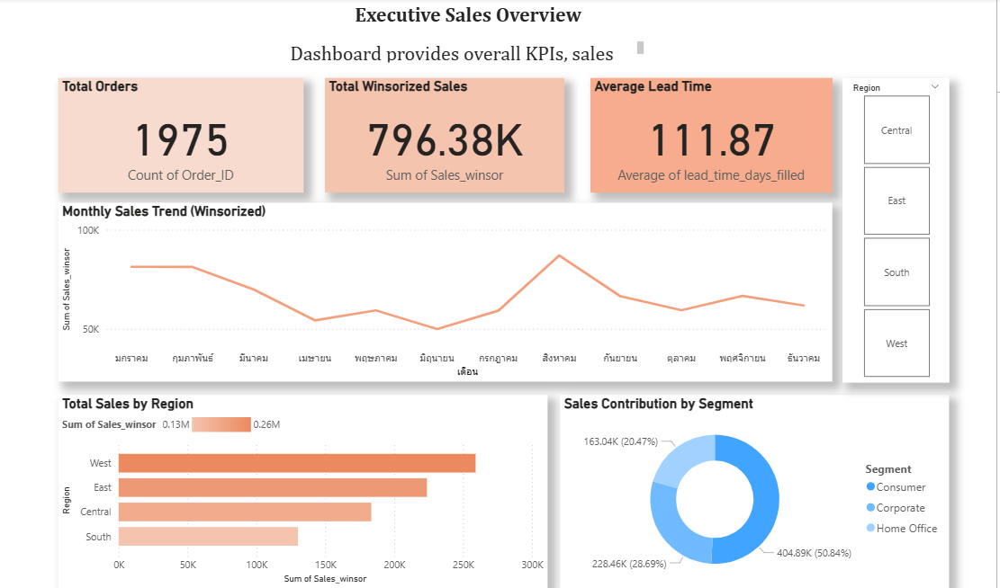
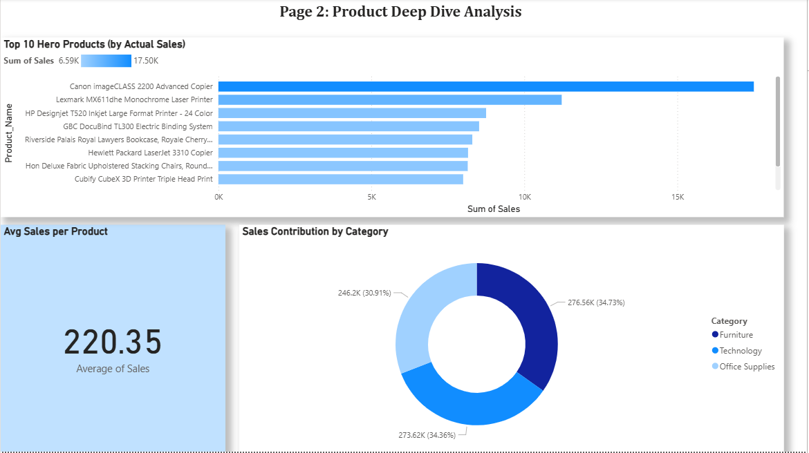
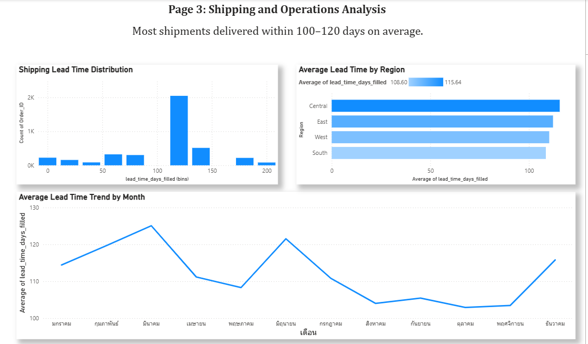

# Superstore Sales Analytics

End-to-end sales analytics project analyzing the Superstore dataset. Includes data cleaning (Python, Pandas), SQL queries, and an executive dashboard built in Power BI.

---

## 🚀 Dashboard Preview

### Page 1: Executive Sales Overview

### Page 2: Product Deep Dive

### Page 3: Shipping & Operations Analysis

---

## 🛠️ Project Structure

* **/data/**: Raw and Processed datasets (Ignored by Git)
* **/notebooks/Superstore_Analysis_Project.ipynb**: Colab notebook with all Python cleaning code and analysis.
* **/powerbi/**: Power BI report file (Ignored by Git)
* **/reports/figures/**: Dashboard screenshots.
* **.gitignore**: Specifies files for Git to ignore.
* **README.md**: This project overview.

---

## 💻 How to Run

1. Download the raw data (e.g., from Kaggle or another source) and place it in /data/raw/.
2. Run the /notebooks/Superstore_Analysis_Project.ipynb in Google Colab to perform cleaning.
3. Open the /powerbi/superstore_report.pbix file in Power BI Desktop.
4. If needed, refresh the data source to point to the superstore_cleaned_final.csv file on your local machine.

---

## 🔑 Key KPIs & Insights

* **Total Sales (Winsorized):** .38K
* **Total Unique Orders:** 1,975
* **Average Lead Time:** 111.87 Days
* **Top Month:** February 2018 (.8K)
* **Top Region:** West ()
* **Top Product (Hero):** Canon imageCLASS 2200 Advanced Copier
